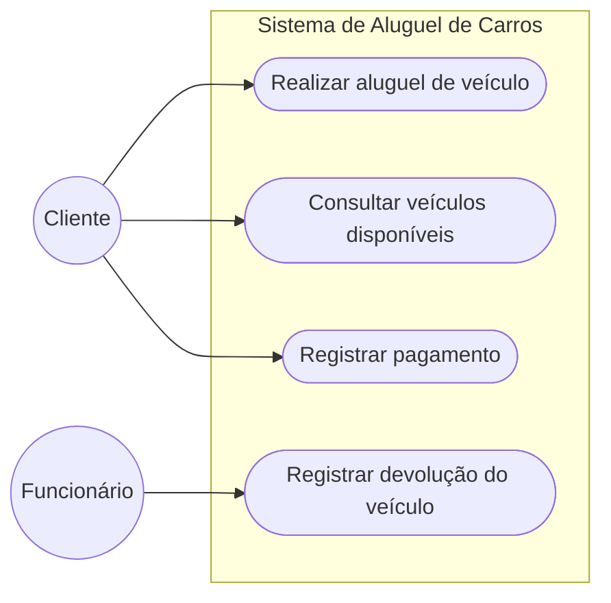
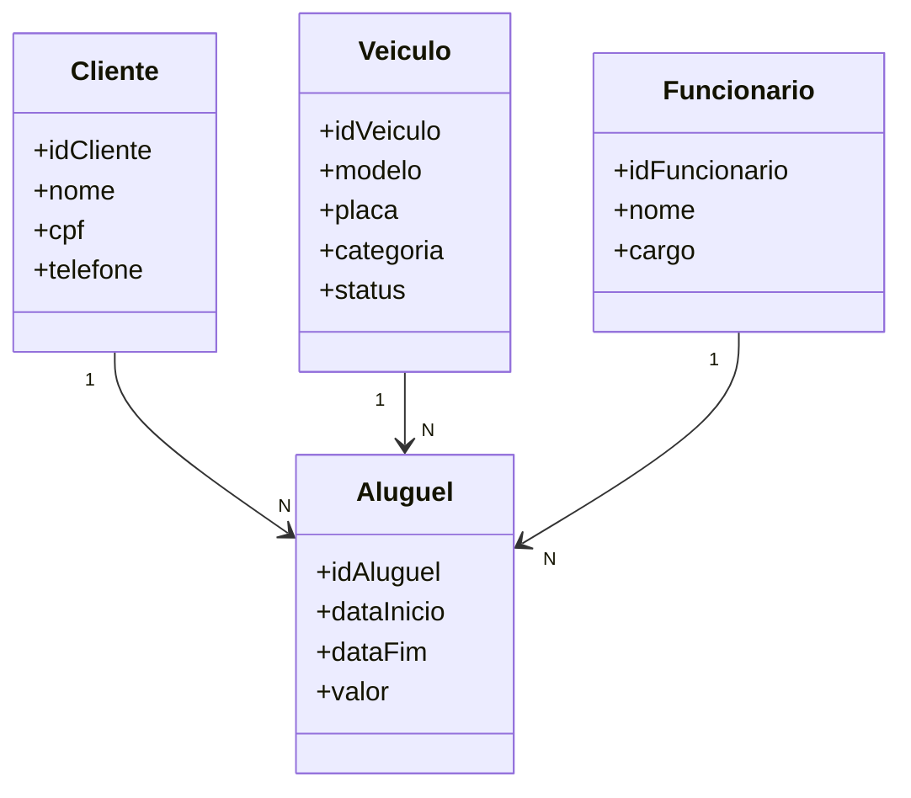

# Diagramas - Sistema de Aluguel de Carros

# Diagrama de Caso de Uso

```mermaid
flowchart LR

Cliente((Cliente))
Funcionario((Funcionário))

subgraph Sistema["Sistema de Aluguel de Carros"]

UC1([Realizar aluguel de veículo])
UC2([Consultar veículos disponíveis])
UC3([Registrar pagamento])
UC4([Registrar devolução do veículo])

end


Cliente --> UC1
Cliente --> UC2
Cliente --> UC3

Funcionario --> UC4
```

---

# Diagrama de Classe

```mermaid
classDiagram


class Cliente{
    +idCliente
    +nome
    +cpf
    +telefone
}


class Veiculo{
    +idVeiculo
    +modelo
    +placa
    +categoria
    +status
}


class Aluguel{
    +idAluguel
    +dataInicio
    +dataFim
    +valor
}


class Funcionario{
    +idFuncionario
    +nome
    +cargo
}


Cliente "1" --> "N" Aluguel
Veiculo "1" --> "N" Aluguel
Funcionario "1" --> "N" Aluguel
```
